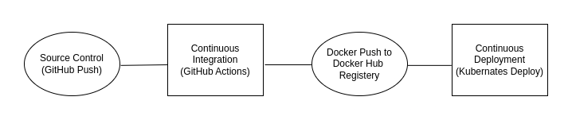

# Report: Cloud-Based Service Solution for Coinbase Exchange

## 1. Introduction
**Objective**: This report presents a container-based solution for the Coinbase crypto exchange, focusing on automating service deployments and maintaining 100% uptime through the use of a CI/CD pipeline and Kubernetes.

**Scope**: The report covers solution architecture, deployment architecture, CI/CD pipeline design, security and ethics challenges, and testing strategies.

---

### Project Scenario

The project focuses on the development of a container-based service solution for managing crypto exchange operations (Coinbase), utilizing Flask, SQLAlchemy, and Kubernetes. Key functionalities include:

- **User Management**: Allowing users to register and authenticate, including account creation and management. The `User` class interacts with the `Account` class, and relationships are defined for trades executed by the user.

- **Account Management**: Users manage their cryptocurrency and fiat (USD) balances through the `Account` class, which supports account creation, update, and deletion functionalities via Flask API endpoints.

- **Trading Operations**: The `Trade` class facilitates the buy/sell transactions between different user accounts. The service ensures proper validation of trade types and currency, with relationships linking accounts to trades.

- **Endpoints**:
    - **/register** and **/login**: API routes to handle user registration and authentication.
    - **/account/add**, **/account/update**, **/account/delete**: To handle account-related operations.
    - **/trade/add**, **/trade/getTradeByAccount**: Trade operations allow users to perform buy/sell transactions.

- **Deployment and Scaling**: The project is designed to be deployed and managed on Kubernetes using CI/CD pipelines for Blue-Green deployments, ensuring smooth updates to the services without downtime.

This project forms the basis for the ITS 2140 coursework, where key concepts of cloud-native service development, containerization, and secure API design are put into practice. The user management, account handling, and trade functionalities represent a simplified simulation of the crypto exchange operations.

----

## 2. Solution Architecture
**Overview**: The designed solution consists of containerized microservices deployed in a Kubernetes cluster. Each service represents a distinct functionality within the Coinbase exchange, ensuring high availability and scalability.

### Solution Diagram:
- 
- A diagram showing microservices interactions, request flows, and data flows.

### Service Components:
#### Services:
- **User Service**: Manages user authentication, registration, and profile management. It interacts with the Account service to manage user accounts and the Trade service to handle trade operations.
- **Trade Service**: Handles buy and sell transactions between accounts, ensuring trade validation and recording.
- **Notification Service**: Sends notifications about trades and account updates to users.

#### Persistent Layer:
- **SQL Database**: A cloud-native relational database (e.g., MySQL or PostgreSQL) to manage user accounts, transactions, and other structured data.
- **NoSQL Database**: Stores unstructured data such as market data and logs for better scalability and performance.

#### Message Queue:
- **Purpose**: Ensures reliable communication between microservices and handles asynchronous processing (e.g., RabbitMQ, Kafka).

#### CI/CD Pipeline:
- **Source Control**: Code is managed on GitHub.
- **Docker Image Build**: Services are containerized using Docker, with Dockerfiles for building images.
- **Automated Testing**: Unit tests are run automatically after each build.
- **Kubernetes Deployment**: Deployment is managed using `kubectl`, with separate namespaces for Dev, Test, and Prod.
- **Blue-Green Deployment**: Allows zero downtime by switching traffic between Blue (current) and Green (new) environments.

#### Kubernetes Cluster:
- **Namespaces**: Dev, Test, and Prod environments are isolated in separate namespaces for better management.
- **Persistent Volumes**: Ensures data consistency and persistence across environments.
- **Ingress Controller**: Manages external access to the services.

#### Monitoring and Logging:
- **Prometheus & Grafana**: For monitoring system metrics and visualizing performance.
- **ELK Stack (Elasticsearch, Logstash, Kibana)**: For centralized logging and analysis.

### Key Design Choices:
- **High Availability**: Achieved through Kubernetes Pods that auto-scale based on traffic.
- **Security**: Leveraging Kubernetes secrets for managing sensitive information like API keys and database credentials.

---

## 3. Deployment Architecture
**Overview**: The deployment is managed through Kubernetes, leveraging multiple environments for development, testing, and production.

### Deployment Diagram:
- 

### Deployment Strategy:
- **Kubernetes Cluster**: Hosted on a cloud provider (AWS/GCloud/Azure) to ensure scalability.
- **Namespace Management**: Each environment (Dev, Test, Prod) runs in its own namespace.
- **Persistent Volumes**: Used for database storage, ensuring data consistency across environments.
- **Blue-Green Deployment**: Used in production to maintain 100% uptime by running two versions of the application (Blue for current, Green for new) and switching traffic after validation.

---

## 4. CI/CD Pipeline
- 
**Overview**: The CI/CD pipeline automates the build, test, and deployment process, ensuring rapid iteration and reliable deployments.

### Pipeline Architecture:
- 

### CI/CD Process Description:
- **Source Control**: Hosted on GitHub.
- **Docker Image Build**: Each service is containerized and built using a Dockerfile.
- **Unit Testing**: Run automated unit tests after each build.
- **Kubernetes Deployment**: Use `kubectl` commands to deploy services to Kubernetes, with separate namespaces for Dev, Test, and Prod.
- **Blue-Green Deployment**: For production, the CI/CD pipeline switches traffic between Blue and Green environments to ensure zero downtime deployments.

---

## 5. Security and Ethics Challenges
- **Data Privacy**: Ensure that user data is stored securely in the cloud, adhering to GDPR and other regulatory requirements.
- **Security of Cloud Infrastructure**:
    - Use secure Kubernetes configurations, such as role-based access control (RBAC) and network policies.
    - Ensure that communication between services is encrypted.
- **Ethical Considerations**: Minimize the impact of downtime during deployments and ensure that users are informed of changes to the service.
- **Public Cloud Implications**: Hosting sensitive financial data on public cloud infrastructure requires strong security measures to prevent unauthorized access.

---

## 6. Implementation of Services
- **Microservices**: Implement mock services representing the core functionality (User Service, Trade Service, Notification Service) using Flask or a similar lightweight framework.
- **Kubernetes Artifacts**:
    - **Deployment YAMLs**: For deploying each service to Kubernetes.
    - **Service YAMLs**: To expose each service via Kubernetes `Service` object.
    - **ConfigMaps and Secrets**: To manage environment-specific configurations and sensitive information.

---

## 7. Test Automation
- **Test Suite**: Implement a test suite that automatically validates the deployment after each release.
- **Automated Testing Tools**: Use tools like Jenkins, GitHub Actions, or CircleCI for running the test suite automatically.
- **Types of Tests**:
    - **Unit Tests**: For individual service logic.
    - **Integration Tests**: Ensure proper communication between microservices.
    - **End-to-End Tests**: Validate the entire workflow from user authentication to trade execution.

---

## 8. RunBook
**Deployment Steps**:
1. **Checkout Code**: `git clone` the repository.
2. **Build Docker Image**: Use Docker to build images for each service.
3. **Deploy to Kubernetes**: Use the provided Kubernetes artifacts to deploy the services.
4. **Blue-Green Deployment**: Deploy new services in the Green environment, then switch traffic to Green after validation.

**Test Steps**:
1. Run the automated test suite to ensure the application is functioning as expected.
2. Monitor logs and performance metrics through Kubernetes dashboards.

---

## 9. Conclusion
**Summary**: This report presents a comprehensive solution for the Coinbase crypto exchange, focusing on containerization, automation through CI/CD pipelines, and ensuring uptime through Blue-Green deployments. The use of Kubernetes provides scalability and high availability, while security measures ensure data integrity and privacy.

---

### Appendices
- **CI/CD Pipeline YAML**: Provide the complete CI/CD pipeline configuration (e.g.GitHub Actions YAML).
- **Kubernetes Deployment YAMLs**: Include the YAML files used to deploy the services.
- **RunBook Instructions**: Step-by-step guide to deploy and test the services.
